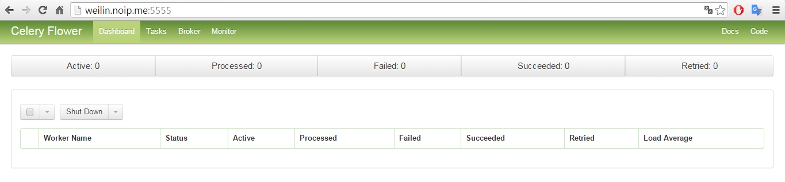
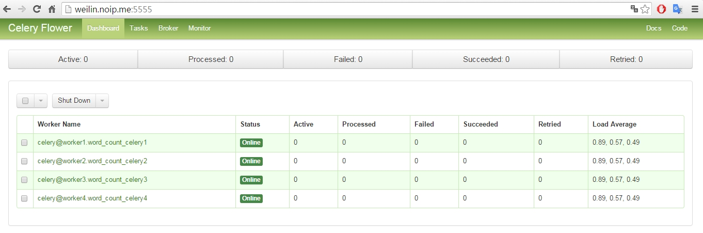
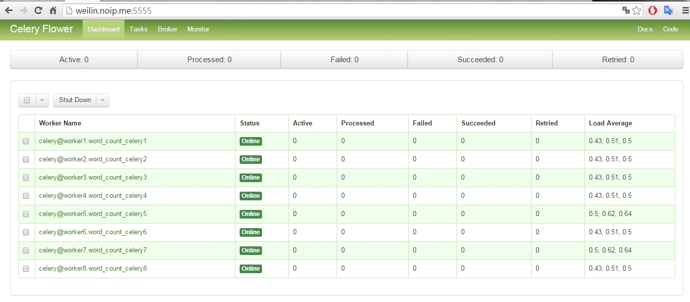
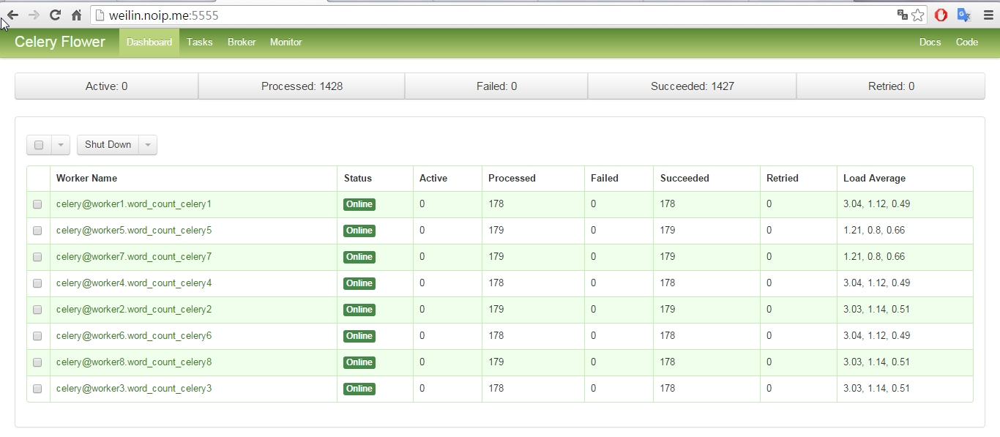
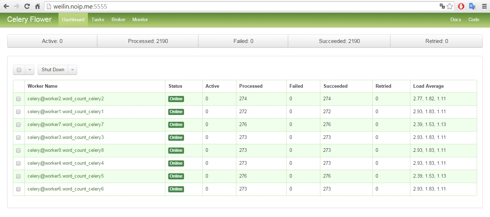
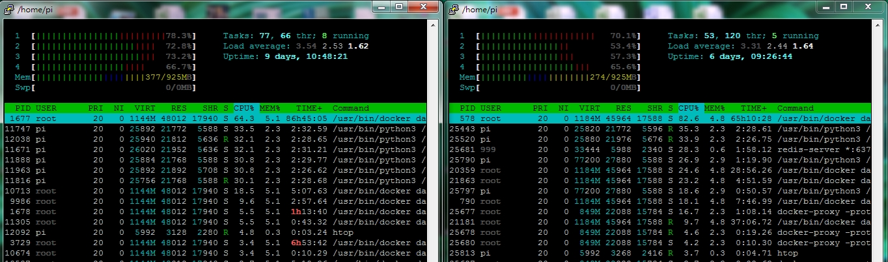

# 使用 Celery 於 Docker Swarm 之上 建構類似 Bluemix 的 IoT 平台
## Part I: Celery on Docker Swarm  

Wei Lin  
20160126  

## 緣起  
前天(2016/01/24)到臺北參加了一場很棒的 關於 [Raspberry Pi](https://www.raspberrypi.org/), [Docker](https://www.docker.com/), [MQTT](http://cheng-min-i-taiwan.blogspot.tw/2015/03/raspberry-pimqtt-android.html), [Bluemix](https://console.ng.bluemix.net/) 的 [講座](https://www.facebook.com/events/1092250660807957/1098932823473074/)。㑹中提到 Bluemix 和 MQTT 是一種 publisher/subscriber 的機制，這讓我想起前幾週接觸到的 [Celery](http://www.celeryproject.org/)，其採用 producer/queue/consumer 模型，我覺得兩者非常的相似。

 在 Python 的領域中，Celery 是一套著名的 distributed task queue framework，用來面對 concurrent 的需求時非常好用，尤其是它的 Canvas 機制更是在平行系統上建構複雜處理流程的利器。

 由於 Celery 能夠在 distributed 的環境下運作，而且原則上 越平行分散 效能越好，這讓我很自然的想要把它與 Docker Swarm 結合起來: Docker Swarm 負責建構 cluster 平台，提供 Celery 所需要的 worker containers，而 Celery 可以在 Docker Swarm 上視需要擴展 worker 與 processes 的數量，平行地完成指定的運算。

  Celery 所採用的機制，簡單來說就是: producer 發出要求運算的訊息到 queue 中排隊，眾多的 workers 紛紛到 queue 去撿出訊息來進行處理。類比於 Bluemix 和 MQTT: producer 就如同 publisher，queue 如同 topic 或 channel，consumer 如同 subscriber，我覺得兩者是十分類似的。

 因此，如果我們可以利用 Dock Swarm 為 Celery 之類的 framework 提供一個 cluster 舞台，是否可以快速的建立一個私有(沒有30天的試用期限)的、類似於 Bluemix 的平台呢？讓其上的 devices 共同組成一個分散式的協同運算系統，視整個 IoT(Internet of Things) 為一體。

然而，除了建構 IoT 平台之外，Celery + Docker Swarm 應該還有其他的用途，因此為了 reusability，把這部分切割出來，本次實驗先只驗證 Celery 在 Docker Swarm 上可以順利的運作。  


## 實驗前提與目標:
- 完全使用 Docker 組裝系統: host上除了 Docker-Engine、Docker-Machine之外 並不安裝其他軟體。
- 建構分散式的運算平台: 於 Docker Swarm 的環境中，使用 Celery 架構一個 distributed task queue。
- Cluster平台可抽換: Celery 和 Docker Swarm decouple，也就是說 Celery 並不知道自己是跑在單一 Docker Machine 或者 Swarm 之上 (其實 Celery 也不知道自己是在 Docker 上面跑)。
- 發揮 Docker Swarm 的功能: 驗證 Docker 能自動將 Celery 所需的 worker container spread 到不同的 Docker Machines 中。
- 驗證 Celery 在 Docker Swarm 中可順利運作: 
 - 由一個 producer(publisher)，發送訊息到特定的 queue(topic) 之後，相應的 consumer(subscribers) 會接收、處理、回應訊息。
 - 就以 Hadoop/MapReduce 領域中的入門程式 "Word Count" 來作為測試案例。

## 實作步驟:

### 建立 Docker Swarm: 
之前已經參考了這篇 [文章](https://www.facebook.com/groups/docker.taipei/permalink/1704032656498757) 使用兩台 RPi2 建立了一個 Docker Swarm。

#### Swarm 中有兩台 Docker machines:
- host rpi202(192.168.0.114) 擔任 Swarm Manager，其 Docker machine name 為 master01
- host rpi201(192.168.0.109) 擔任 Swarm Node，其 Docker machine name 為 node01


```python
HypriotOS: pi@rpi202 in ~
$ docker-machine ls
NAME       ACTIVE   DRIVER    STATE     URL                        SWARM
master01            hypriot   Running   tcp://192.168.0.114:2376   master01 (master)
node01              hypriot   Running   tcp://192.168.0.109:2376   master01
HypriotOS: pi@rpi202 in ~
$


# Swarm 中的 nodes:

HypriotOS: pi@rpi202 in ~
$ docker $(docker-machine config --swarm master01) info
Containers: 4
Images: 51
Role: primary
Strategy: spread
Filters: health, port, dependency, affinity, constraint
Nodes: 2
 master01: 192.168.0.114:2376
  └ Status: Healthy
  └ Containers: 3
  └ Reserved CPUs: 0 / 4
  └ Reserved Memory: 0 B / 972 MiB
  └ Labels: executiondriver=native-0.2, kernelversion=4.1.8-hypriotos-v7+, operatingsystem=Raspbian GNU/Linux 8 (jessie), provider=hypriot, storagedriver=overlay
 node01: 192.168.0.109:2376
  └ Status: Healthy
  └ Containers: 1
  └ Reserved CPUs: 0 / 4
  └ Reserved Memory: 0 B / 972 MiB
  └ Labels: executiondriver=native-0.2, kernelversion=4.1.8-hypriotos-v7+, operatingsystem=Raspbian GNU/Linux 8 (jessie), provider=hypriot, storagedriver=overlay
CPUs: 8
Total Memory: 1.899 GiB
Name: b7def5d9af98
HypriotOS: pi@rpi202 in ~
$
```

### 建立 Docker Overlay network: 


```python
# Swarm 中原本的 networks:

HypriotOS: pi@rpi202 in ~
$  docker $(docker-machine config --swarm master01) network ls
NETWORK ID          NAME                DRIVER
f73c178c37f9        master01/bridge     bridge
414ed2b10a9d        master01/none       null
930b58fd0d33        master01/host       host
759c7acf7c0a        node01/none         null
0954a9483bae        node01/host         host
21bce8ef40ec        node01/bridge       bridge
HypriotOS: pi@rpi202 in ~
$ 


# 建立一個 overlay network:

HypriotOS: pi@rpi202 in ~
$ docker network create --driver=overlay mynet
1feac8ae92873e78570b904b0d3f848b49a180c15ebe0a4ff38f1a2cbcc691c5
HypriotOS: pi@rpi202 in ~
$


# Swarm 中目前的 networks，有看到新建的 overlay network "mynet":

HypriotOS: pi@rpi202 in ~
$ docker $(docker-machine config --swarm master01) network ls
NETWORK ID          NAME                DRIVER
930b58fd0d33        master01/host       host
1feac8ae9287        mynet               overlay
f73c178c37f9        master01/bridge     bridge
21bce8ef40ec        node01/bridge       bridge
759c7acf7c0a        node01/none         null
0954a9483bae        node01/host         host
414ed2b10a9d        master01/none       null
HypriotOS: pi@rpi202 in ~
$


# Swarm Manager 所在的 host中 所看到的 networks，有看到新建的 overlay network "mynet":

HypriotOS: pi@rpi202 in ~
$ docker network ls
NETWORK ID          NAME                DRIVER
f73c178c37f9        bridge              bridge
414ed2b10a9d        none                null
930b58fd0d33        host                host
1feac8ae9287        mynet               overlay
HypriotOS: pi@rpi202 in ~
$


# Swarm Node 所在的 host中 所看到的 networks，有看到新建的 overlay network "mynet":

HypriotOS: pi@rpi201 in ~
$ docker network ls
NETWORK ID          NAME                DRIVER
1feac8ae9287        mynet               overlay
21bce8ef40ec        bridge              bridge
759c7acf7c0a        none                null
0954a9483bae        host                host
HypriotOS: pi@rpi201 in ~
$
```

### 建立 Celery 所需的 Broker，使用 Redis


```python
HypriotOS: pi@rpi202 in ~
$ docker run -d -p 6379:6379 --net=mynet --name=redis --volume=/data:/data hypriot/rpi-redis
a2abf9277b5e4818da89ffa282a706506ef288426486cc25b431208564bf6e0f


HypriotOS: pi@rpi202 in ~
$ docker ps
CONTAINER ID        IMAGE                      COMMAND                  CREATED             STATUS              PORTS                                                                    NAMES
a2abf9277b5e        hypriot/rpi-redis          "/entrypoint.sh redis"   13 hours ago        Up About an hour    0.0.0.0:6379->6379/tcp                                                   redis
f0ce33ca1152        hypriot/rpi-swarm          "/swarm join --advert"   6 days ago          Up 6 days           2375/tcp                                                                 swarm-agent
b7def5d9af98        hypriot/rpi-swarm          "/swarm manage --tlsv"   6 days ago          Up 6 days           0.0.0.0:3376->3376/tcp, 2375/tcp                                         swarm-agent-master
ad594813f8f0        nimblestratus/rpi-consul   "/bin/start -server -"   6 days ago          Up 6 days           53/udp, 8300-8302/tcp, 8301-8302/udp, 8400/tcp, 0.0.0.0:8500->8500/tcp   consul
HypriotOS: pi@rpi202 in ~
$
```

### 將檔案 celeryconfig.py、start_workers.sh、資料夾 word_count 複製到 兩台 hosts 的 /data/celery_projects 資料夾之下

#### 可以使用 SCP 來達成: http://www.hypexr.org/linux_scp_help.php  

例如:  
HypriotOS: pi@rpi202 in ~  
$ scp -r /data/celery_projects root@rpi201:/data/


```python
HypriotOS: pi@rpi202 in /data/celery_projects
$ ll
total 20
drwxr-xr-x 3  999 root 4096 Jan 25 23:01 ./
drwxr-xr-x 3  999 root 4096 Jan 25 23:01 ../
-rw-r--r-- 1  999 root 1079 Jan 25 21:12 celeryconfig.py
-rwxr-xr-x 1  999 root  732 Jan 25 22:53 start_workers.sh*  <--- 用來啟動 worker containers 的 script，後述。
drwxr-xr-x 3 root root 4096 Jan 25 23:01 word_count/
HypriotOS: pi@rpi202 in /data/celery_projects
$


HypriotOS: pi@rpi201 in /data/celery_projects
$ ll
total 20
drwxr-xr-x 3 root root 4096 Jan 25 23:03 ./
drwxr-xr-x 3  999 root 4096 Jan 25 22:55 ../
-rw-r--r-- 1 root root 1079 Jan 25 21:12 celeryconfig.py
-rw-r--r-- 1 root root  732 Jan 25 22:53 start_workers.sh   <--- 用來啟動 worker containers 的 script，後述。
drwxr-xr-x 3 root root 4096 Jan 25 23:03 word_count/
HypriotOS: pi@rpi201 in /data/celery_projects
$
```

### 建立監控用的 [Flower ](http://docs.celeryproject.org/en/latest/userguide/monitoring.html#flower-real-time-celery-web-monitor) container


```python
HypriotOS: pi@rpi202 in ~
$ docker run -d -p 5555:5555 --net=mynet --name=flower --volume=/data/celery_projects:/celery_projects wei1234c/celery_armv7 /bin/sh -c "cd /celery_projects && celery -A word_count flower"
276f00591fd7042139ddf660730d223bcf19e9f8bd369f075de417140b6dfd4a
HypriotOS: pi@rpi202 in ~
$


HypriotOS: pi@rpi202 in ~
$ docker ps
CONTAINER ID        IMAGE                      COMMAND                  CREATED             STATUS              PORTS                     NAMES
276f00591fd7        wei1234c/celery_armv7      "/bin/sh -c 'cd /cele"   31 seconds ago      Up 27 seconds       0.0.0.0:5555->5555/tcp    flower
```

#### Flower 的 container 起來之後，就可以用瀏覽器查看，不過目前都還是空的


### 透過 Swarm Manager 建立並佈署 Celery worker containers

#### 用來建立 worker containers 的 script
start_workers.sh


```python
# ./start_workers.sh

echo "Starting Celery cluster containers _________________________________________________"

eval $(docker-machine env --swarm master01)

PROJECT=$1  # project 名稱
WORKER_START_ID=$2  # worker container 編號 第一個
WORKER_LAST_ID=$3  # worker container 編號 最後一個
CONCURRENCY=$4  # 每個 worker 可以有幾個 subprocesses

for (( i=${WORKER_START_ID}; i<=${WORKER_LAST_ID}; i=i+1 ))
do
  docker run -d --name=${PROJECT}_celery${i} --hostname=${PROJECT}_celery${i} --net=mynet --volume=/data/celery_projects:/celery_projects wei1234c/celery_armv7 /bin/sh -c "cd /celery_projects && celery -A ${PROJECT} worker -n worker${i}.%h --concurrency=${CONCURRENCY} --loglevel=INFO"
done
```

#### 初始建立 Celery worker containers
建立了 4 個 containers，每個 container 有一個 Celery worker，每個 worker 可以使用 5 個 subprocesses。  
因為這個 Swarm 採取 spread 策略，所以 4 個都被 schedule 到 container 數量偏少的那一台 Docker machine 上面。


```python
# CLI 參數說明:
# $1 # project 名稱
# $2 # worker container 編號 第一個
# $3 # worker container 編號 最後一個
# $4 # 每個 worker 可以有幾個 subprocesses

HypriotOS: pi@rpi202 in /data/celery_projects
$ ./start_workers.sh word_count 1 4 5
Starting Celery cluster containers _________________________________________________
a22b08a0818b3246f90511ad21cb2a0ab37a4e72661bf559ade7e320db030505
77eabded27e4ea3aaa640480c088fa7b4b9818fc3e40fb66636cc9abe8a78e69
df05a7204f40470cfd8eee21a06be45f5a306ea32df0196f3d004beac5d2f82d
e67d39740ace5c2a5b9a05e6ca1adc73c5e5944e62302d02391d37f7ee6aa479


# 建立了 4 個 containers，每個 container 有一個 Celery worker，每個 worker 可以使用 5 個 subprocesses。

# 因為採取 spread 策略，所以 4 個都被 schedule 到 container 數量偏少的一台 Docker machine。

HypriotOS: pi@rpi202 in /data/celery_projects
$ docker ps
CONTAINER ID        IMAGE                      COMMAND                  CREATED              STATUS              PORTS                                                                          NAMES
e67d39740ace        wei1234c/celery_armv7      "/bin/sh -c 'cd /cele"   About a minute ago   Up About a minute   5555/tcp                                                                       node01/word_count_celery4
df05a7204f40        wei1234c/celery_armv7      "/bin/sh -c 'cd /cele"   About a minute ago   Up About a minute   5555/tcp                                                                       node01/word_count_celery3
77eabded27e4        wei1234c/celery_armv7      "/bin/sh -c 'cd /cele"   About a minute ago   Up About a minute   5555/tcp                                                                       node01/word_count_celery2
a22b08a0818b        wei1234c/celery_armv7      "/bin/sh -c 'cd /cele"   About a minute ago   Up About a minute   5555/tcp                                                                       node01/word_count_celery1
276f00591fd7        wei1234c/celery_armv7      "/bin/sh -c 'cd /cele"   37 minutes ago       Up 5 minutes        192.168.0.114:5555->5555/tcp                                                   master01/flower
a2abf9277b5e        hypriot/rpi-redis          "/entrypoint.sh redis"   13 hours ago         Up About an hour    192.168.0.114:6379->6379/tcp                                                   master01/redis
980161d10fc4        hypriot/rpi-swarm          "/swarm join --advert"   6 days ago           Up 6 days           2375/tcp                                                                       node01/swarm-agent
f0ce33ca1152        hypriot/rpi-swarm          "/swarm join --advert"   6 days ago           Up 6 days           2375/tcp                                                                       master01/swarm-agent
b7def5d9af98        hypriot/rpi-swarm          "/swarm manage --tlsv"   6 days ago           Up 6 days           2375/tcp, 192.168.0.114:3376->3376/tcp                                         master01/swarm-agent-master
ad594813f8f0        nimblestratus/rpi-consul   "/bin/start -server -"   6 days ago           Up 6 days           53/udp, 8300-8302/tcp, 8301-8302/udp, 8400/tcp, 192.168.0.114:8500->8500/tcp   master01/consul
HypriotOS: pi@rpi202 in /data/celery_projects
$
```

#### Flower 中就會顯示 workers，目前有4個 workers
- celery@worker1.word_count_celery1
- celery@worker2.word_count_celery2
- celery@worker3.word_count_celery3
- celery@worker4.word_count_celery4  



#### 擴增 Celery worker containers
可以隨時動態的擴增 Celery 的 scale 以因應效能的需求。  
這次再增建了 4 個 containers，每個 container 有一個 Celery worker，每個 worker 可以使用 5 個 subprocesses。  
因為這個 Swarm 採取 spread 策略，而且當下兩台 Docker machines 上的 containers 數量相當，所以第二次擴增的這 4 個 containers 被平均地 schedule 到兩台 Docker machines 上面。


```python
# $1 # project 名稱
# $2 # worker container 編號 第一個
# $3 # worker container 編號 最後一個
# $4 # 每個 worker 可以有幾個 subprocesses

HypriotOS: pi@rpi202 in /data/celery_projects
$ ./start_workers.sh word_count 5 8 5
Starting Celery cluster containers _________________________________________________
a4de4967fd6211266cbad04fecfc357aa81789063cca3042388019adab2a6c71
7066ba6021de870f1332858c6f96673a159d7e5031a5682d3853fa6bd8fe2252
79792c823fbf2769e4983c525598c30ba3758c23697ef66a78a54163374d3233
25c02d07ed6f1217ee68dc486a6586262ca2e3ed01a2a8690eaa2a783ad07d73


HypriotOS: pi@rpi202 in /data/celery_projects
$ docker ps
CONTAINER ID        IMAGE                      COMMAND                  CREATED              STATUS              PORTS                                                                          NAMES
25c02d07ed6f        wei1234c/celery_armv7      "/bin/sh -c 'cd /cele"   18 seconds ago       Up 12 seconds       5555/tcp                                                                       node01/word_count_celery8
79792c823fbf        wei1234c/celery_armv7      "/bin/sh -c 'cd /cele"   39 seconds ago       Up 25 seconds       5555/tcp                                                                       master01/word_count_celery7
7066ba6021de        wei1234c/celery_armv7      "/bin/sh -c 'cd /cele"   About a minute ago   Up 45 seconds       5555/tcp                                                                       node01/word_count_celery6
a4de4967fd62        wei1234c/celery_armv7      "/bin/sh -c 'cd /cele"   About a minute ago   Up About a minute   5555/tcp                                                                       master01/word_count_celery5
e67d39740ace        wei1234c/celery_armv7      "/bin/sh -c 'cd /cele"   15 minutes ago       Up 15 minutes       5555/tcp                                                                       node01/word_count_celery4
df05a7204f40        wei1234c/celery_armv7      "/bin/sh -c 'cd /cele"   15 minutes ago       Up 15 minutes       5555/tcp                                                                       node01/word_count_celery3
77eabded27e4        wei1234c/celery_armv7      "/bin/sh -c 'cd /cele"   15 minutes ago       Up 15 minutes       5555/tcp                                                                       node01/word_count_celery2
a22b08a0818b        wei1234c/celery_armv7      "/bin/sh -c 'cd /cele"   16 minutes ago       Up 16 minutes       5555/tcp                                                                       node01/word_count_celery1
276f00591fd7        wei1234c/celery_armv7      "/bin/sh -c 'cd /cele"   51 minutes ago       Up 19 minutes       192.168.0.114:5555->5555/tcp                                                   master01/flower
a2abf9277b5e        hypriot/rpi-redis          "/entrypoint.sh redis"   14 hours ago         Up 2 hours          192.168.0.114:6379->6379/tcp                                                   master01/redis
980161d10fc4        hypriot/rpi-swarm          "/swarm join --advert"   6 days ago           Up 6 days           2375/tcp                                                                       node01/swarm-agent
f0ce33ca1152        hypriot/rpi-swarm          "/swarm join --advert"   6 days ago           Up 6 days           2375/tcp                                                                       master01/swarm-agent
b7def5d9af98        hypriot/rpi-swarm          "/swarm manage --tlsv"   6 days ago           Up 6 days           2375/tcp, 192.168.0.114:3376->3376/tcp                                         master01/swarm-agent-master
ad594813f8f0        nimblestratus/rpi-consul   "/bin/start -server -"   6 days ago           Up 6 days           53/udp, 8300-8302/tcp, 8301-8302/udp, 8400/tcp, 192.168.0.114:8500->8500/tcp   master01/consul
HypriotOS: pi@rpi202 in /data/celery_projects
$
```

#### 在 Swarm node 上也可以看到透過 Swarm manager 遠端建立的 containers


```python
HypriotOS: pi@rpi201 in /data/celery_projects
$ docker ps
CONTAINER ID        IMAGE                   COMMAND                  CREATED             STATUS              PORTS               NAMES
25c02d07ed6f        wei1234c/celery_armv7   "/bin/sh -c 'cd /cele"   16 minutes ago      Up 16 minutes       5555/tcp            word_count_celery8
7066ba6021de        wei1234c/celery_armv7   "/bin/sh -c 'cd /cele"   17 minutes ago      Up 17 minutes       5555/tcp            word_count_celery6
e67d39740ace        wei1234c/celery_armv7   "/bin/sh -c 'cd /cele"   32 minutes ago      Up 31 minutes       5555/tcp            word_count_celery4
df05a7204f40        wei1234c/celery_armv7   "/bin/sh -c 'cd /cele"   32 minutes ago      Up 32 minutes       5555/tcp            word_count_celery3
77eabded27e4        wei1234c/celery_armv7   "/bin/sh -c 'cd /cele"   32 minutes ago      Up 32 minutes       5555/tcp            word_count_celery2
a22b08a0818b        wei1234c/celery_armv7   "/bin/sh -c 'cd /cele"   32 minutes ago      Up 32 minutes       5555/tcp            word_count_celery1
980161d10fc4        hypriot/rpi-swarm       "/swarm join --advert"   6 days ago          Up 6 days           2375/tcp            swarm-agent
HypriotOS: pi@rpi201 in /data/celery_projects
$
```

#### Flower 中就會顯示 目前兩台 machines 中共有8個 workers = 8 x 5 = 40 個 processes 可共使用



### 用來測試的程式碼


```python
from word_count.tasks import * 
 
# 將 text 檔案拆解成 list of words    
def getWordsFromText(file = '.\\text\\test.txt'):
    with open(file) as f:
        lines = f.readlines()        
    return ' '.join(lines).replace(',', '').replace('.', '').split()


def reduce(word_counts):    
    wordCounts = {}
    
    for word_count in word_counts:
        if word_count is not None: 
            wordCounts[word_count[0]] = wordCounts.get(word_count[0], 0) + word_count[1]
        
    result = sorted(list(wordCounts.items()), 
                    key = lambda x: (x[1], x[0]), 
                    reverse = True)    
    return result
```


```python
# list of words
words = getWordsFromText()
words[:3]
```


    ["Aesop's", 'Fables', 'Translated']


```python
# 字數總計
len(words)
```


    2190


#### ./word_count/tasks.py 中所定義的 mapper 函數:
    from celery import group
    from word_count.celery import app 
    
    @app.task
    def mapper(word):
        return (word, 1) if len(word) >= 5 else None    # 過濾掉太短的word

### 發送 message 要求 Celery workers 做平行運算並回應結果


```python
def count_celery(words):
    
    # 發送給 Celery 執行
    asyncResults = [mapper.s(word).delay() for word in words]  # mapper 是定義在 ./word_count/tasks.py 中
    results = [asyncResult.get() for asyncResult in asyncResults if asyncResult.get() is not None]

    return reduce(results)  

%time counts = count_celery(words)
counts[:5]
```

    Wall time: 3min 23s
    


    [('would', 12), ('which', 8), ('their', 8), ('caught', 6), ('Farmer', 6)]


#### 訊息一送出去，Flower 中就會顯示執行的狀況
  

#### 執行完畢


#### 過程中 CPUs 並不是非常忙碌，還可以再壓榨一些


## Summary:
雖然Bluemix的功能完整性相對的高很多，但是個人覺得兩者的原理是類似的。考量資料安全性與成本，若我們可以使用 Docker Swarm 和 Message Queue 快速地建構私有的 IoT 平台 也許是一個可以考慮的選擇。  

本次實驗先驗證 Celery 可以在 Docker Swarm 上面運作 並獲得 scalability，後續再設計一個 IoT 網路來模擬 devices 之間的互動。
